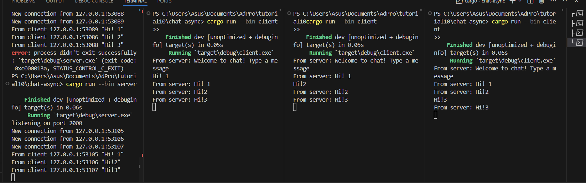
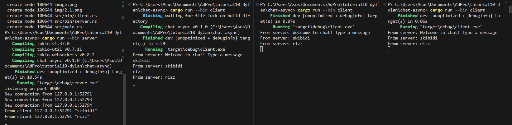

Untuk menjalankan program broadcast chat kita perlu eksekusi server dengan `cargo run --bin server` dan dengan konteks tutorial jalankan 3 klien dengan menggunakan perintah `cargo run --bin client` pada terminal terpisah, tiga client tersebut terhubung pada server yang sama dengan port yang berbeda, saat teks diberikan melalui suatu client, maka server akan menerima teks tersebut dan melakukan broadcast ke seluruh client yang terhubung dengan server.

Saat memodifikasi port pada sisi client, maka pada program server juga perlu dilakukan modifikasi portnya menjadi 8080 pada bagian TCP Listener, hal ini membuat server dan client dapat terhubung dengan koneksi websocket yang sama dengan port yang berbeda dari sebelumnya.